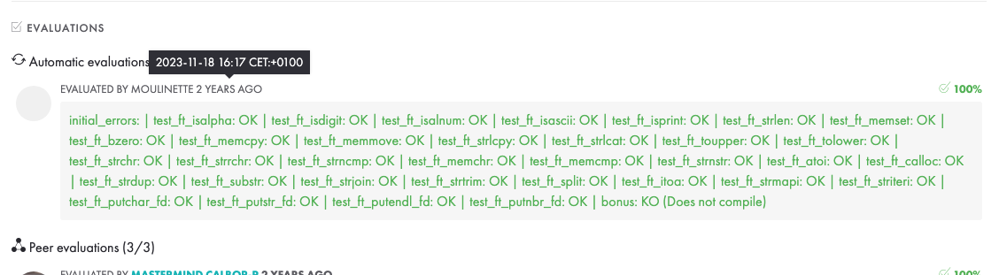

|          Grade          |          Tests          |
|:-----------------------:|:-----------------------:|
|  |  |

<br>

---

<details>
<summary>🇫🇷 FRENCH VERSION</summary>

<p align="center">
	Ceci est le premier <a href="./subject/Libft.en.subject.pdf">projet</a> de l'école 42 (réalisé en novembre 2023). 
</p>

## Préambule
Le but est d’écrire une bibliothèque statique en C qui réimplémente des fonctions standard de la `libc` ainsi que des fonctions utilitaires pour les projets suivants.

## Compétences:
- Réécriture des fonctions `libc` (ex : `ft_strlen`, `ft_memcpy`, `ft_atoi`, etc.)
- Fonctions supplémentaires  (`ft_split`, `ft_strtrim`, `ft_itoa`, etc.)
- Makefile et code conformes au standard de codage Norminette
- Gestion manuelle de la mémoire
- Debugging avec GDB

## Installation
```bash
git clone https://github.com/N0fish/Libft.git
cd Libft
make
```

</details>

---

<details>
<summary>🇬🇧 ENGLISH VERSION</summary>

<p align="center">
	This is the first <a href="subject/Libft.en.subject.pdf">project</a> at 42 School (completed in November 2023).
</p>

## Preamble
The goal is to write a static C library that re-implements standard `libc` functions and additional utilities used in later projects.

## Skills:
- Rewriting of `libc` functions (e.g. `ft_strlen`, `ft_memcpy`, `ft_atoi`, etc.)
- Additional utilities (`ft_split`, `ft_strtrim`, `ft_itoa`, etc.)
- Makefile and code are compliant with the Norminette coding standard
- Manual memory management in C
- Debugging with GDB

## Installation
```bash
git clone https://github.com/N0fish/Libft.git
cd Libft
make
```

</details>

---

<details>
<summary>🇷🇺 RUSSIAN VERSION</summary>

<p align="center">
	Это первый <a href="subject/Libft.en.subject.pdf">проект</a> в школе 42 (выполненный в ноябре 2023 года).
</p>

## Преамбула
Цель — написать статическую библиотеку на языке C, реализуя функции из стандартной библиотеки `libc`, а также дополнительные функции, которые используются в последующих проектах.

## Навыки:
- Переписанные функции `libc` (например: `ft_strlen`, `ft_memcpy`, `ft_atoi` и др.)
- Дополнительные функции (`ft_split`, `ft_strtrim`, `ft_itoa`, и др.)
- Поддержка Makefile и соответствие кода стандарту Norminette
- Работа с памятью и динамическое распределение
- Отладка с GDB

## Установка
```bash
git clone https://github.com/N0fish/Libft.git
cd Libft
make
```

</details>

---

<br>

<a name="functions"></a>
## Libft functions

| Libc functions                     | Additional functions                     |
| ---------------------------------- | ---------------------------------------- |
| [ft_isalpha](ft_isalpha.c)         | [ft_substr](ft_substr.c)                 |
| [ft_isdigit](ft_isdigit.c)         | [ft_strjoin](ft_strjoin.c)               |
| [ft_isalnum](ft_isalnum.c)         | [ft_strtrim](ft_strtrim.c)               |
| [ft_isascii](ft_isascii.c)         | [ft_split](ft_split.c)                   |
| [ft_isprint](ft_isprint.c)         | [ft_itoa](ft_itoa.c)                     |
| [ft_strlen](ft_strlen.c)           | [ft_strmapi](ft_strmapi.c)               |
| [ft_memset](ft_memset.c)           | [ft_striteri](ft_striteri.c)             |
| [ft_bzero](ft_bzero.c)             | [ft_putchar_fd](ft_putchar_fd.c)         |
| [ft_memcpy](ft_memcpy.c)           | [ft_putstr_fd](ft_putstr_fd.c)           |
| [ft_memmove](ft_memmove.c)         | [ft_putendl_fd](ft_putendl_fd.c)         |
| [ft_strlcpy](ft_strlcpy.c)         | [ft_putnbr_fd](ft_putnbr_fd.c)           |
| [ft_strlcat](ft_strlcat.c)         | [ft_atoi_long.c](ft_atoi_long.c)         |
| [ft_toupper](ft_toupper.c)         |                                          |
| [ft_tolower](ft_tolower.c)         |                                          |
| [ft_strchr](ft_strchr.c)           |                                          |
| [ft_strrchr](ft_strrchr.c)         |                                          |
| [ft_strncmp](ft_strncmp.c)         |                                          |
| [ft_memchr](ft_memchr.c)           |                                          |
| [ft_memcmp](ft_memcmp.c)           |                                          |
| [ft_strnstr](ft_strnstr.c)         |                                          |
| [ft_atoi](ft_atoi.c)               |                                          |
| [ft_calloc](ft_calloc.c)           |                                          |
| [ft_strdup](ft_strdup.c)           |                                          |
